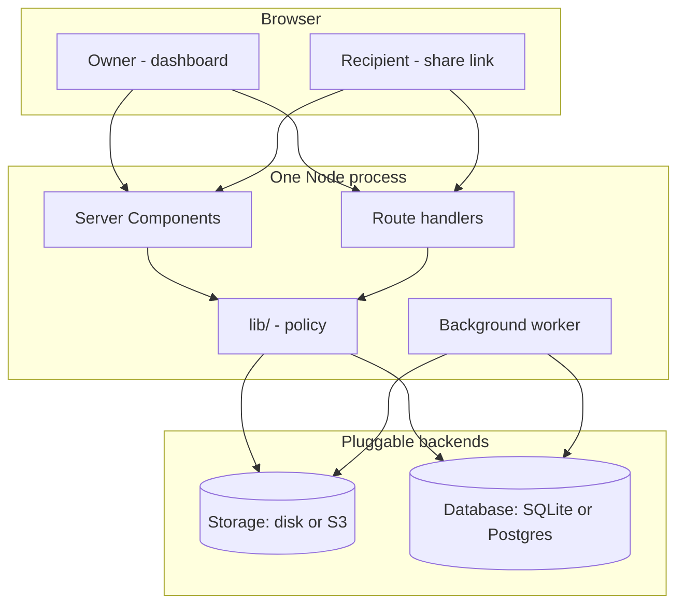

# Architecture

How Borealis is put together, and why it is put together that way. Companion to
[`database.md`](database.md), which covers the schema, and
[`roadmap.md`](roadmap.md), which covers what is missing.

Written against `feat/file-host`. Every claim cites the file that proves it.

---

## The shape of it

One Next.js process. No queue service, no cache, no worker container, no
sidecar. The default deployment is a single image with SQLite on a volume and
files on a second volume, and everything below is downstream of that decision.



The worker is not a separate process. `instrumentation.ts` starts it inside the
server on boot, guarded on `NEXT_RUNTIME === "nodejs"` so the edge runtime —
which has no database — never tries. The trade is stated in `lib/jobs.ts`: a
query every five seconds costs less than a second service to babysit on a box
nobody is watching.

Two consequences worth knowing before scaling it out: every replica runs its own
worker and its own hourly sweep enqueue, and there is no lock beyond the
`updateMany`-scoped claim in `runOne()`. Horizontal scaling is possible but
untested (roadmap item 19).

---

## Three surfaces, three ways in

The single most important structural fact about this codebase is that
*authorisation is different on each surface*, and the surfaces never share a
code path.

| Surface | Routes | Authorised by | Gate |
|---|---|---|---|
| The vault | `/dashboard/*`, `/api/list`, `/api/search`, `/api/file/*`, `/api/shares/*`, `/api/upload/*`, `/api/invites/*`, `/api/admin/*` | A better-auth session cookie | `getSession()` in every handler; `app/dashboard/layout.tsx` for pages |
| A share | `/s/<token>`, `/api/s/<token>/*` | Possession of the token, plus an unlock cookie when the share has a password | `guardShare()` — `lib/shares/guard.ts` |
| A reverse share | `/r/<token>`, `/api/reverse-upload/*` | Possession of the token | `openReverseShare()` — `lib/tus-reverse.ts` |

Nothing on the vault surface accepts a share token, and nothing on the share
surface accepts a session. `app/api/file/[id]/route.ts` spells out the reason in
its header comment: keeping owner download and public download apart means the
share guard is *the only* code path that can serve bytes to someone without an
account. There is no branch inside a shared handler that could be reasoned about
incorrectly and open the other one.

The same principle produced two tus mounts rather than one with a flag —
`lib/tus.ts` and `lib/tus-reverse.ts`. The authenticated mount's rule stays "a
session is required, always"; nothing in the anonymous mount can weaken it.

### Route protection is two-tier, deliberately

`proxy.ts` (Next 16's rename of `middleware.ts`) checks only for the *presence*
of a session cookie and redirects to `/login` if it is absent. It runs detached
from the app and must not touch the database, so it cannot validate anything.
The authoritative check is `app/dashboard/layout.tsx`, which calls
`getSession()` server-side and redirects on failure.

The proxy is a fast path for the common case, never an access control. Any new
protected page must sit under a layout that does the real check.

---

## Layers

```
app/**/route.ts           parse, authorise, respond. No policy, no storage keys.
app/**/page.tsx           Server Components. Query, shape, hand to a client island.
lib/                      the policy. Guards, expiry, permissions, hashing.
lib/storage, lib/search   interfaces with per-backend implementations.
lib/generated/prisma      the client. Regenerated by `bun run db:setup`.
```

Route handlers are thin on purpose. `app/api/shares/route.ts` parses with Zod,
checks ownership, and delegates every decision that could be wrong — expiry
resolution to `resolveExpiry()`, password hashing to `hashSharePassword()`. Its
`[id]` sibling does the same for editing, delegating the item-set diff and the
cap arithmetic to `lib/shares/edit.ts`. The things worth unit-testing therefore
live in `lib/` and are testable without a request: `lib/permissions.test.ts`,
`lib/shares/edit.test.ts`, and `lib/crypto/*.test.ts` do exactly that.

`lib/shares/edit.ts` also earns its keep on the client: `capWarnings` is pure,
so the edit dialog warns that a cap would close a link using the rule
`guardShare` enforces rather than a second copy of it.

Two abstractions are real rather than speculative — both have two live
implementations:

- **`StorageProvider`** (`lib/storage/provider.ts`) — `LocalStorageProvider`
  writes under `STORAGE_PATH`, `S3StorageProvider` talks to any S3-compatible
  endpoint. Selected once at module load in `lib/storage/index.ts`.
- **`SearchProvider`** (`lib/search/provider.ts`) — SQLite gets `LIKE`, Postgres
  gets `websearch_to_tsquery` with `ts_headline` snippets. Selected the same way.

Neither is behind a factory the caller has to thread through: both export a
singleton (`storage`, `search`) chosen from the environment at import time. The
cost is that switching backends needs a restart; the benefit is that no call
site has to know which backend it is on.

---

## Identity, invitations, roles

Authentication is better-auth (`lib/auth.ts`) on the Prisma adapter, sharing the
same connection as the app. Email/password is always on. OAuth providers
register only when both halves of a credential pair are present, so an
unconfigured provider is absent rather than broken — `socialProvider()` returns
`null`, and the login form only renders buttons that will work
(`lib/socialProviders.ts`).

### The invitation gate

Sign-up is closed. The gate is a single `databaseHooks.user.create.before` hook
(`lib/auth.ts:112`), which is the one place every account-creating path passes
through: email sign-up, each social provider, and OIDC. Gating the sign-up form
would have left "Continue with GitHub" wide open.

The flow:

1. `POST /api/invite` validates a code and parks it in a short-lived HTTP-only
   cookie (`INVITE_COOKIE`, 15 minutes). It does **not** consume the code — the
   cookie exists so the code survives the redirect out to an OAuth provider and
   back, and so a visitor learns their code is wrong before a full round trip.
2. `user.create.before` re-reads the cookie, re-validates the invite, and
   rejects with `FORBIDDEN` if it is missing, spent, revoked, or expired. The
   role comes from the invite, never from the client.
3. `user.create.after` burns the code with an `updateMany` scoped to
   `redeemedAt: null`, so two concurrent sign-ups cannot both claim it.

Codes are stored as unsalted SHA-256 (`lib/invites.ts`). Unsalted is correct
here and the file says why: these are 160 bits of randomness, not passwords, so
there is nothing to brute-force and lookup must stay one indexed query.

### Roles

Three roles, and the hierarchy is not the obvious one:

- **root** (`id "0"`) is seeded with no credential and cannot be signed into
  until someone with shell access runs `root set-password`. Control of the
  instance follows control of the server.
- **admin** may invite users and manage ordinary users. An admin may **not**
  mint another admin, revoke another admin's invitation, ban another admin, or
  delete another admin's files.
- **user** owns their own files and nothing else.

That admin/admin boundary is the trust model, and it is enforced in three
independent places that agree: `canMintRole()` for invitations,
`canDeleteFile()` / `deletableFileWhere()` for files (`lib/permissions.ts`), and
an explicit check in `app/api/admin/users/[id]/route.ts` for bans and role
changes. Root is untouchable through the web on that last one — it is managed
from the console, which is the point of it having no credential.

`deletableFileWhere()` exists so the *list* and the *action* cannot drift: one
returns a boolean, the other expresses the same rule as a Prisma filter.

---

## The share guard

`guardShare()` in `lib/shares/guard.ts` is the single gate for share access, and
its check order is load-bearing:

1. missing → `NOT_FOUND` (404)
2. revoked → `REVOKED` (**404**, not 403 — a token must not be probeable for
   existence)
3. expired → `EXPIRED` (410)
4. *download only:* view-only → `VIEW_ONLY` (403)
5. *download only:* download cap → `DOWNLOAD_LIMIT` (410)
6. *download only:* egress cap, projected against the file about to be served →
   `EGRESS_LIMIT` (429)
7. password → `PASSWORD_REQUIRED` (401)

Password is checked **last** so that an expired or exhausted share does not
become a password oracle. Revoked and missing return the same status so a token
cannot be tested for existence. The `GUARD_STATUS` map is exported alongside, so
the status code for a reason is decided once.

Callers pass `isDownload: true` only when bytes are about to move; reading share
metadata for the public page skips checks 4–6 (`app/s/[token]/page.tsx`).

### Clearing the password gate

`POST /api/s/[token]/unlock` verifies with scrypt (`lib/shares/password.ts` —
Node's built-in, so the project carries no native crypto dependency) and on
success sets a cookie containing an HMAC over `shareId.expiresAt`, keyed by
`BETTER_AUTH_SECRET` and **mixed with the current password hash**.

That last detail is the whole design: because the password hash is an input to
the MAC, changing or clearing a share's password invalidates every outstanding
unlock cookie at once. Revocation needs no server-side session store, and
`PATCH /api/shares/[id]` gets the behaviour for free — it writes the new hash
and nothing else. Note that scrypt salts randomly, so re-setting the *same*
password also invalidates every outstanding unlock.

Failures are logged as `UNLOCK_FAIL` rows with IP and user agent, and the
response is identical for a wrong password, a missing share, a revoked share,
and an expired one.

---

## The upload path

Uploads are tus (resumable), mounted as Next catch-all routes that forward to a
`@tus/server` instance: `app/api/upload/[[...tus]]/route.ts` exports one handler
under six verb names.

```
client (tus-js-client)
  → POST /api/upload            create; namingFunction() resolves the owner
  → PATCH … PATCH …             bytes, resumable
  → onUploadFinish              File row + EXTRACT_TEXT job, X-File-Id header
```

Three things about this are non-obvious and easy to break:

**Storage keys must be a single path segment.** tus derives the upload id from
the URL relative to its `path`, so a `/` inside the id produces a two-segment
URL its router will not match — the bytes land but every subsequent
`PATCH`/`HEAD` 404s. Hence `<ownerId>_<uuid>`, with an underscore.

**tus writes through its own store, not through `StorageProvider`.** The upload
path uses `FileStore`/`S3Store`; the download path reads through
`LocalStorageProvider`/`S3StorageProvider`. They meet because both are pointed
at the same `STORAGE_PATH` or `S3_BUCKET`, not because they share code. Changing
one without the other silently breaks downloads for new uploads.

**Client metadata is input, not truth.** `namingFunction` and `onUploadFinish`
re-resolve the session rather than trusting a `userId` in metadata, and
`onIncomingRequest` re-checks it on every verb. The one field that escapes this
discipline is `folderId`, written straight from metadata into the row
(`lib/tus.ts:105`) with no ownership check — inert today because nothing creates
folders, a live IDOR the moment folders ship (roadmap item 20).

Reverse uploads (`lib/tus-reverse.ts`) have no session at all. The share token in
metadata is the only credential, so `openReverseShare()` re-checks type,
revocation, expiry, and file count on *both* `onUploadCreate` and
`onUploadFinish` — the first before a byte is accepted, the second because a
slow upload may outlive the window it started in. Files created this way belong
to the share's owner, not the sender, and an `UPLOAD` row goes into the same
audit log a download would.

---

## The download path

Two routes serve bytes, and they are deliberately unrelated:

- `GET /api/file/[id]` — owner only. Same 404 whether the file is missing or
  someone else's.
- `GET /api/s/[token]/download/[fileId]` — public, through the guard. It first
  confirms the file is actually an item of *that* share; without that check any
  token would be a key to every file on the instance.

Both end in `serveFile()` (`lib/download.ts`), which is the only place that
frames a body. Bytes are streamed, never buffered: a 4 GB download costs one
chunk of heap rather than 4 GB, and four concurrent ones cost four chunks.

`Range` is negotiated there too — `Accept-Ranges: bytes` on every response, 206
with `Content-Range` for a slice, 416 for a range past the end — so a dropped
download resumes and media can be seeked. The arithmetic lives in
`lib/range.ts`, pure and unit tested; the slice is pushed down into
`StorageProvider.stream(key, range)` so the bytes never leave the disk or the
bucket in the first place.

Two consequences worth knowing:

**A missing object must be discovered before the first byte.** Once a status
line has gone out it cannot be taken back, so a read that fails mid-stream can
only truncate the download. Both providers therefore open eagerly and reject,
rather than surfacing the failure later as a stream error.

**Egress is counted from the stream, not from the file's size.** `lib/metering.ts`
wraps the body and reports what actually went out, because those are different
numbers the moment a recipient disconnects — someone who takes 10 MB of a 4 GB
file used 10 MB. Accounting then runs inside `after()`, so it never delays the
response: one transaction increments `egressUsedBytes` and writes the
`ShareAccess` row. `downloadCount` increments only for a *whole-file* request,
since a resume or a media seek costs bandwidth but is not another download —
counting one per request would let a single scrub through a video exhaust a
three-download cap. If `notifyOnDownload` is set, a `NOTIFY_DOWNLOAD` job is
enqueued for whole-file requests only.

Downloads are sent `Cache-Control: private, no-transform`. The `private` half is
obvious. The `no-transform` half is load-bearing: Next compresses route handler
responses by default, and a gzipped body loses its `Content-Length` and stops
agreeing with the offsets in `Content-Range`.

---

## Zero-knowledge shares

Encryption is entirely client-side and the server is never a participant.

`lib/crypto/e2e.ts` encrypts a `File` into a Blob of repeated
`[4-byte length][12-byte IV][ciphertext]` frames, 4 MB per frame, AES-GCM, a
fresh IV per chunk (reusing one across chunks under a single key leaks plaintext
relationships). Chunking is what keeps a multi-gigabyte upload off the heap on
the way *out*.

The key never travels as a request. Two carriers:

- **fragment** — a random 256-bit key encoded into the URL's `#k=` fragment.
  Browsers never put fragments on the wire, not in the request line and not in
  `Referer`, so the server serves a page for a link whose key it has never seen.
  `lib/crypto/fragment.ts` encodes a *list* of `fileId.key` pairs, since a share
  can carry several files.
- **password** — the key is derived with PBKDF2 (310k iterations) from a
  passphrase, so nothing about it travels at all. Strictly stronger than an
  ordinary share password, where the server verifies a hash and therefore sees
  the password.

`lib/crypto/keyring.ts` keeps keys in `localStorage` against the file id so the
owner can re-share or re-download later. The consequence is honest and must stay
visible in the interface: that is the only copy. Clearing site data destroys the
file for everyone, operator included.

What the server still sees: filename, size, content type, and the fact of the
upload. What it can no longer do: extract text (`lib/jobs.ts` marks `FileText`
`SKIPPED` with that reason), compute a meaningful checksum, generate a
thumbnail, or preview.

Decryption (`lib/crypto/save.ts`) buffers the whole file in memory. That is
inherent to decrypting client-side without the File System Access API, and it is
the practical ceiling on zero-knowledge transfers — plain transfers have no such
limit.

---

## Background work

A table, not a broker. `Job` rows are polled every 5 s by the loop in
`lib/jobs.ts`.

```
findFirst PENDING, runAt <= now
  → updateMany scoped to status: PENDING   (the claim — a second worker loses)
  → switch on type
  → DONE, or PENDING with runAt += attempts × 30s, or FAILED at 3 attempts
```

Each tick drains up to 50 jobs rather than taking one, so a burst of uploads
indexes promptly. An `EXPIRE_SWEEP` is enqueued hourly rather than run inline, so
it shares the same retry and logging path as everything else.

| Type | Enqueued by | Handled |
|---|---|---|
| `EXTRACT_TEXT` | both tus mounts, via `enqueuePostUploadJobs()` | yes |
| `CHECKSUM` | the same seam, for every upload including E2E | yes |
| `EXPIRE_SWEEP` | hourly `setInterval` in `startWorker()` | yes |
| `PURGE_FILE` | `expireSweep()`, one per file whose trash window closed | yes |
| `NOTIFY_DOWNLOAD` | the share download route | **no** — falls to `default:`, marked `DONE` |

The `default:` branch retires unknown types instead of retrying them forever,
which is right for a genuinely unknown type and wrong for `NOTIFY_DOWNLOAD`,
where it silently swallows a promise the UI makes.

`expireSweep()` does three things: marks past-expiry shares revoked
(housekeeping — the guard already refuses them), deletes `ShareAccess` rows
older than 30 days, and enqueues a `PURGE_FILE` job for every trashed file whose
retention window has closed. The audit window is still hard-coded at
`lib/jobs.ts`, undocumented in the README, and it destroys the audit trail the
product sells; treat it as a setting waiting to happen, the way trash retention
already is.

### Deleting a file

Deletion is two events with a window between them, and which one you get depends
on whose file it is.

```
POST /api/file/[id]/delete
  ├─ your own file      → revoke carrying shares, set deletedAt      (trash)
  └─ someone else's     → revoke carrying shares, bytes + row, now   (permanent)

expireSweep(), hourly
  → findDueForPurge()   deletedAt <= now - TRASH_RETENTION_DAYS
  → one PURGE_FILE job per file

PURGE_FILE
  → re-read the row; still exists? still trashed? still due?
  → bytes, then row
```

Reaching another account's file requires admin or root, and an admin acting on a
user's file is moderation or disk pressure — a moderation action its target can
undo from their own trash is not a moderation action. The response says which
happened in `trashed`, so the interface never offers an undo that does not
exist.

The retention window lives in `lib/purge.ts`, which owns the arithmetic and
nothing else: no database, no storage, no clock but the one it is handed. That
is what makes it unit-testable, and `lib/purge.test.ts` covers the boundary
where a file comes due. `lib/trash.ts` is the seam that acts on those decisions —
`trashFile`, `restoreFile`, `purgeFile`, `revokeSharesCarrying` — shared by the
delete endpoint, the restore endpoint, `POST /api/trash/empty`, and the job.

Three details are load-bearing:

- **The purge job re-checks everything it was told.** A restore can land between
  the sweep enqueueing the job and the worker reaching it, so `deletedAt` is
  read again and `isPurgeDue()` re-evaluated against the row as it stands. A
  trash that can be raced is a delayed delete, not a trash.
- **Trashing revokes every share carrying the file; restoring does not bring
  them back.** A link pointing into the trash would 404 mid-download, and one
  that sprang back to life on restore would be a link nobody re-checked. Getting
  the file back is not the same as re-opening what you had already handed out.
- **A storage failure fails the job rather than the row.** `purgeFile()` lets
  the error propagate so the worker retries with backoff; only "already gone"
  (`ENOENT`, `NoSuchKey`, 404) counts as success, since that is the goal state.
  Interactive callers pass `orphanOnStorageFailure` to opt out — an admin must
  not be blocked by a hiccuping object store.

`POST /api/trash/empty` purges the caller's trash inline rather than queueing it,
because "empty the trash" is a promise about now and a queued version would leave
the files listed for another poll interval. Files whose bytes could not be
reached are counted separately and left trashed for the sweep to retry.

Text extraction (`lib/extract.ts`) is conservative by design: plain text and its
lookalikes, PDF via `unpdf`, DOCX via `mammoth`, and an explicit `skipped`
reason for everything else. A scanned PDF yields no embedded text and is
recorded as `"no embedded text (likely a scan — OCR not enabled)"` rather than
as an empty successful extraction, because those two states must not look alike.

---

## Mail

`lib/email.ts` wraps nodemailer, lazily, and mail is optional throughout. When
`SMTP_HOST`/`SMTP_FROM` are unset, `sendMail()` writes the whole message —
including the link — to the server log instead of dropping it, so an operator
debugging "the reset link never arrived" finds both the link and the reason in
their own logs.

Messages are plain text only. A file host that emails rich HTML is teaching its
own users to click styled links from strangers.

Password reset is gated on `emailVerified` (`lib/auth.ts`). better-auth has no
flag for that, so the refusal lives in `sendResetPassword` and returns success
either way — saying "that address isn't verified" would confirm the account
exists. An instance with no SMTP recovers accounts from the console:
`bun run root passwd <email>`.

---

## Configuration

Every setting is read from `process.env` at boot. `.env.example` is the full
list; `docker-compose.yml` is the same list again as a stack environment.

| Group | Variables |
|---|---|
| Required | `BETTER_AUTH_SECRET` — the container refuses to start without it |
| Origin | `BETTER_AUTH_URL` / `BOREALIS_URL`, `BOREALIS_PORT` |
| Database | `DATABASE_PROVIDER`, `DATABASE_URL` |
| Storage | `STORAGE_DRIVER`, `STORAGE_PATH`, `S3_*` |
| Trash | `TRASH_RETENTION_DAYS` — days a deleted file keeps its bytes, default 7 |
| Mail | `SMTP_HOST`, `SMTP_PORT`, `SMTP_USER`, `SMTP_PASSWORD`, `SMTP_FROM`, `SMTP_SECURE` |
| Sign-in | `{DISCORD,GITHUB,GOOGLE,MICROSOFT}_CLIENT_{ID,SECRET}`, `OIDC_ISSUER`, `OIDC_CLIENT_ID`, `OIDC_CLIENT_SECRET`, `OIDC_DISPLAY_NAME` |
| Proxy | `TRUST_PROXY` |

`TRUST_PROXY` is the one with teeth: it makes `clientIp()` (`lib/request.ts`)
trust `X-Forwarded-For`. Set it only behind a proxy you control, because on a
directly exposed instance it lets any caller forge their own audit-log entry. It
is all-or-nothing — there is no trusted-CIDR list.

The `AppSetting` model exists for runtime configuration editable from an admin
panel without a restart. It has zero references in the codebase (roadmap item
17). Until it is wired up, every setting change is a container restart, and a
database provider change is a rebuild.

---

## Build and deployment

`next.config.ts` sets `output: "standalone"`, so the image ships
`.next/standalone` rather than `node_modules`. `serverExternalPackages` keeps
native and generated modules out of the bundle: `better-sqlite3`, the Prisma
SQLite adapter, the three `@tus` packages, and `nodemailer`.

The Dockerfile is three stages — `deps` with the native toolchain present (so
`better-sqlite3` compiles for real rather than falling back to a prebuild that
may not match the platform), `builder`, and `runner`. Two details in `builder`
are worth knowing:

- **The database provider is baked in at build time.** Prisma cannot take a
  provider from an environment variable, so `scripts/set-db-provider.mts` copies
  a template from `prisma/providers/` into `prisma/schema/datasource.prisma`
  before `prisma generate` runs. An image is built for one database. Postgres
  means `--build-arg DATABASE_PROVIDER=postgresql`.
- **The admin console is compiled, not shipped as source.** `scripts/root.mts`
  is bundled by esbuild into one ESM file and exposed as `borealis-root`.
  Shipping the `.mts` would mean hand-picking tsx's transitive dependencies into
  the runner and re-picking them whenever hoisting changes.

The Prisma CLI gets its own isolated install under `/opt/prisma` for the same
class of reason: copying `prisma` and `@prisma` out of the builder leaves
transitive dependencies missing, and the exact set moves between releases.

`docker/entrypoint.sh` runs before the server accepts a request: refuse to start
without `BETTER_AUTH_SECRET`, warn on a missing `BETTER_AUTH_URL`, create the
SQLite directory and the upload directory, `prisma migrate deploy`, seed root,
then `exec` the server. Doing it here rather than in an init container keeps the
default Portainer stack to one service.

### Running it without Docker

`bun install`, then `bun run setup` (generate client → migrate → seed root), then
`bun run dev`. `.env` needs `BETTER_AUTH_SECRET`, `BETTER_AUTH_URL`, and
`DATABASE_URL` — the last two are commented out in `.env.example` because Docker
supplies them differently.

One runtime constraint: `better-sqlite3` does not work under the Bun runtime
([oven-sh/bun#4290](https://github.com/oven-sh/bun/issues/4290)). It does not
affect the app, because `next dev` and `next build` run on Node, but a standalone
script that touches the database must run under Node. That is why `bun run root`
is `tsx --env-file=.env scripts/root.mts` and not `bun run scripts/root.mts`.

---

## The frontend

Server Components by default. Pages query Prisma directly, convert `BigInt` to
`Number` at the boundary, and hand plain objects to client islands — see
`app/dashboard/page.tsx`, which runs four queries in one `Promise.all` and only
fetches invitations when the viewer is an admin.

Nineteen files carry `"use client"`, and they are the ones that must: the
uploaders (tus and WebCrypto), the tables with multi-select, the dialogs, the
unlock and reset forms, and the encrypted download button. Everything else
renders on the server.

`components/world/` is the design system — `Panel`, `DataRow`, `StateTag`,
`DensityMeter`, `Ramp`, `GlyphText`, icons. `components/ui/` is stock shadcn,
repointed at the same tokens so it inherits the world rather than fighting it.

The visual system is defined in `app/globals.css` and is unusually opinionated,
so it is worth stating rather than discovering: tone is carried by **density**,
not hue. One ink per surface, stepped through a seven-value ramp
(`ink-00` → `ink-100`) that mirrors the glyph ramp `. : - = + * @`. Two registers
share one geometry — green for the operator's own vault, amber for a hand-off to
someone else — and two grounds share one ramp, dark (phosphor on glass) and
light (thermal printout, ramp inverted so "denser" still reads as "more
present"). Nothing is rounded; `--radius` is `0px` at every step.

Both themes are first-class and WCAG 2.1 AA is binding — see the accessibility
section of [`../PRODUCT.md`](../PRODUCT.md), which is the authority on what the
interface may and may not claim.

---

## Where the bodies are

Short version of [`roadmap.md`](roadmap.md), for someone reading this file to
decide where to start:

- `NOTIFY_DOWNLOAD` is enqueued and silently discarded (item 2).
- `viewOnly` is enforced everywhere and there is no viewer to make it useful
  (item 3).
- Nothing rate-limits the unlock endpoint, though `UNLOCK_FAIL` rows are already
  being collected (item 21).
- `Folder` and `AppSetting` are modelled but unimplemented — see the table at the
  end of the roadmap.
