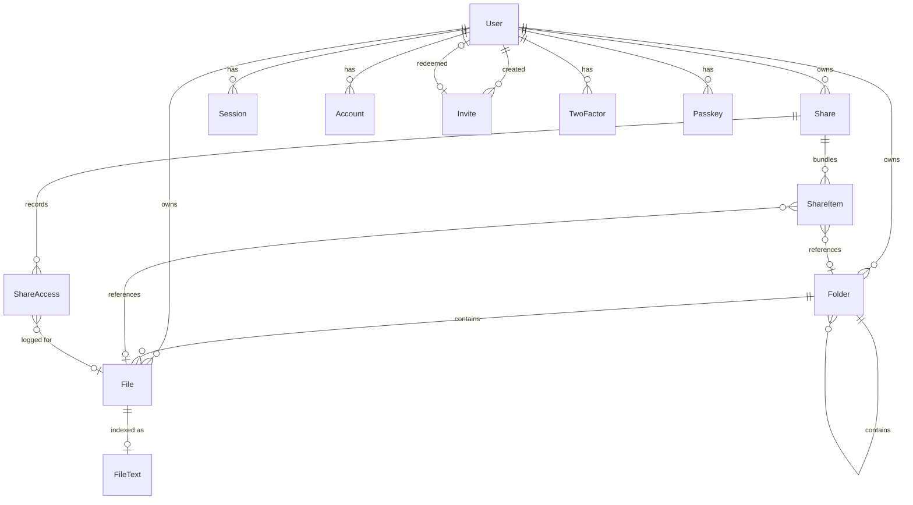

# Database

The schema, the two-provider arrangement that keeps it portable, and the rules
you have to know before changing it. Companion to
[`architecture.md`](architecture.md), which covers how the code around it is
laid out.

Source of truth is `prisma/schema/` — this file explains it, it does not replace
it.

---

## One model set, two databases

Borealis runs on SQLite (default) or PostgreSQL. There is exactly one copy of
the models; what differs is a datasource block and a migration history.

Prisma will not take `datasource.provider` from an environment variable — it
must be a literal — so `bun run db:setup` does the substitution itself:

```
DATABASE_PROVIDER=sqlite            (or postgresql)
        │
        ├─ scripts/set-db-provider.mts
        │     copies prisma/providers/<provider>.prisma
        │       → prisma/schema/datasource.prisma
        │
        ├─ prisma.config.ts
        │     points migrations at prisma/migrations/<provider>/
        │
        └─ prisma generate → lib/generated/prisma/
```

Three files therefore agree with each other or nothing works:

| File | Reads `DATABASE_PROVIDER` to decide |
|---|---|
| `scripts/set-db-provider.mts` | which datasource template to copy |
| `prisma.config.ts` | which migration directory to use |
| `lib/db.ts` | which adapter to construct (`PrismaPg` vs `PrismaBetterSqlite3`) |
| `lib/auth.ts` | which provider to tell better-auth's Prisma adapter |
| `lib/search/index.ts` | `LIKE` (SQLite) or `tsquery` (Postgres) |

`prisma/schema/datasource.prisma` is **generated**. Edit the template in
`prisma/providers/`, never the generated file — `db:setup` overwrites it.

Because the client is generated for one provider, **changing provider is a
regenerate, and in Docker a rebuild.** The Dockerfile bakes it in with
`ARG DATABASE_PROVIDER`. A mismatch between the generated client and the
adapter surfaces immediately as a connection error rather than as quiet
misbehaviour, which is the intended failure mode.

---

## Conventions

- **Ids are `cuid()`** everywhere except `User`, `Session`, `Account`, and
  `Verification`, whose ids better-auth generates, and `AppSetting`, keyed by
  its own `key` string. The root account is the one hard-coded id: `"0"`.
- **No Prisma enums.** SQLite has none, and the schema must generate identically
  for both providers, so every enum-ish column is a `String`. The allowed values
  are listed in each model's doc comment. `prisma/schema/models.prisma:5` says
  they live in `lib/constants.ts`; that file does not exist yet, and the
  literals are currently scattered as bare strings across routes and the worker
  (roadmap item 5).
- **Byte counts are `BigInt`** — `File.size`, `Share.egressLimitBytes`,
  `Share.egressUsedBytes`, `Share.maxUploadBytes`, `ShareAccess.bytesServed`. A
  file host that overflows at 2 GB would be embarrassing.
- **Nullable means "unlimited" or "forever"**, consistently: `expiresAt`,
  `maxDownloads`, `egressLimitBytes`, `maxUploadFiles`, `maxUploadBytes`,
  `passwordHash`. There is no sentinel value for "no limit".
- **Revocation is soft, and so is deletion — for a while.** `revokedAt` keeps a
  share's audit trail readable after it stops working. `File.deletedAt` is a
  trash: the row and its bytes survive a retention window, then the `PURGE_FILE`
  job removes both together (see *Lifecycle*).
- **Timestamps are `@default(now())` / `@updatedAt`.** Nothing sets them by hand.

### `BigInt` at the JSON boundary

`JSON.stringify` throws on `BigInt`, so every route and page that returns byte
counts converts explicitly — `Number(file.size)` in `app/api/list/route.ts`,
`Number(share.egressUsedBytes)` in `app/api/shares/route.ts` and
`app/dashboard/page.tsx`. Anything new that returns one of the `BigInt` columns
must do the same, or the response 500s at serialisation time rather than at the
query.

---

## The shape



`Job`, `AppSetting`, `Verification`, `RateLimit`, `Lease`, and `AuditEvent` stand
alone — no foreign keys in either direction. `AuditEvent` keeps its actor's id
and email as plain columns, so the record of what an admin did outlives the
admin's account.

---

## Models

### `User`, `Session`, `Account`, `Verification`

better-auth's core tables plus the columns its `admin` plugin needs (`banned`,
`banReason`, `banExpires`, `Session.impersonatedBy`). **Field names are dictated
by better-auth and must not be renamed.**

`User.role` is a nullable string holding `"root" | "admin" | "user"`. Nullable
matters: `deletableFileWhere()` in `lib/permissions.ts` treats `null` as an
ordinary user, because pre-invite accounts may not have it set.

Exactly one root exists, `id "0"`, seeded by `bun run setup` with no `Account`
row at all — so there is no credential to sign in with until an operator runs
`root set-password`.

`User.twoFactorEnabled` belongs to the `twoFactor` plugin. `User.storageQuotaBytes`
is Borealis's own: null means "the instance default" (`DEFAULT_QUOTA`), not
unlimited — an operator who wants one account uncapped sets a large number on
purpose.

### `TwoFactor`, `Passkey`, `RateLimit`

Plugin tables, field names dictated by better-auth.

- **`TwoFactor`** — the TOTP secret and backup codes, both encrypted by
  better-auth with `BETTER_AUTH_SECRET` before they reach the row.
- **`Passkey`** — WebAuthn credentials from `@better-auth/passkey`. The public
  key is public; nothing here lets a database reader sign in. `credentialID` is
  `@unique` although the plugin only indexes it: the authenticator chooses that
  value, and sign-in looks the row up by it, so a crafted registration must not
  be able to copy someone else's.
- **`RateLimit`** — fixed-window counters. better-auth's own keys, and
  Borealis's under a `borealis:` prefix (`lib/rate-limit.ts`). In the database
  so a restart does not hand a brute-forcer a fresh window. Rows idle for a day
  are pruned by the sweep.

### `Invite`

One code, one account. `codeHash` is an unsalted SHA-256 of the plaintext, which
is shown once at creation and never stored.

| Column | Note |
|---|---|
| `codeHash` | `@unique` — the lookup index; the plaintext exists nowhere |
| `grantsRole` | `"user"` or `"admin"`. Only root may mint `"admin"` |
| `expiresAt` | null = never expires; default is 7 days |
| `revokedAt` | set while unused; a redeemed invite cannot be revoked |
| `redeemedAt` / `redeemedById` | set atomically when an account is created against it |

`redeemedById` is `@unique`, so an invite maps to at most one user and a user to
at most one invite. Both user relations are `onDelete: SetNull` — deleting a
user leaves the invitation history intact.

### `Folder`

A self-referencing tree (`parentId` → `FolderTree`) with an owner, a soft-delete
column, and a `ShareItem` relation for sharing a whole folder. Created and moved
from the vault, and created by folder upload (`/api/folders/ensure`). An upload's
client-supplied `folderId` is kept only when the folder belongs to the uploader
(`assertOwnedFolder` in `lib/tus.ts`).

### `File`

The central row. One per stored object.

| Column | Note |
|---|---|
| `storageKey` | `@unique`. Server-generated, never user input. The key a `StorageProvider` addresses, and also the tus upload id — so it must stay a single path segment |
| `originalName` | Attacker-controlled. Never interpolate it into a header without `contentDisposition()` (`lib/http.ts`) |
| `size` | `BigInt` |
| `checksum` | sha256 of the stored bytes, written by the `CHECKSUM` job after upload. Covers the ciphertext for an E2E file, never the plaintext. Null means "not yet computed" |
| `deletedAt` | Trash. Set by deleting your own file, cleared by restore, and read by the `PURGE_FILE` job once `TRASH_RETENTION_DAYS` have passed. Filtered by every list, search, and share query |
| `isEncrypted` | True when the bytes were encrypted in the browser. Suppresses text extraction |
| `encryptionMeta` | JSON `{ salt, iv, chunkSize, algorithm }`. Never key material |
| `folderId` | `onDelete: SetNull` — deleting a folder orphans its files rather than destroying them |
| `thumbnailKey` | The `thumb_<id>.webp` object the `THUMBNAIL` job wrote, or null. Never sent to a browser; routes serve it by file id |
| `scanStatus` / `scanDetail` | `"CLEAN" \| "INFECTED" \| "SKIPPED" \| "FAILED"`, or null when no scanner is configured. `INFECTED` withholds the file from every public route; `scanDetail` holds the signature name or the failure, for the operator — the interface shows only the status |

Indexed on `ownerId`, `folderId`, `deletedAt`, and `checksum` — the last one
non-unique, since identical bytes are legal today and it is groundwork for
dedupe.

A file's bytes count against its owner's quota from upload until purge,
trash included (`lib/quota.ts`).

### `Share`

One public token, one bundle, one set of limits. `type` is `"SEND"` (serves
files out) or `"REVERSE"` (collects files in); the reverse-only columns are
ignored for `SEND` and vice versa.

| Group | Columns | Enforced by |
|---|---|---|
| Identity | `token` (`@unique`; 16 random bytes as 22 base64url chars — 128 bits of entropy), `name`, `description` | — |
| Gate | `passwordHash` (scrypt, `scrypt$N$r$p$salt$hash`) | `guardShare()` step 8; the unlock lockout |
| Clock | `expiresAt` (null = forever), `revokedAt` | `guardShare()` steps 2–3 |
| Network | `allowedIps` — comma-separated addresses and CIDRs, null = anywhere | `guardShare()` step 4, and the reverse upload mount |
| Caps | `maxDownloads` / `downloadCount`, `egressLimitBytes` / `egressUsedBytes` | `guardShare()` steps 6–7 |
| Mode | `viewOnly`, `isE2E` | `guardShare()` step 5; `isE2E` is presentational |
| Notify | `notifyOnDownload`, `notifyEmail` | a `NOTIFY_DOWNLOAD` job per whole-file download, at most ten an hour per share |
| Reverse | `maxUploadBytes`, `maxUploadFiles`, `requireUploader` | `openReverseShare()` in `lib/tus-reverse.ts` |

The counters are the accounting record: incremented in the `after()` block of
the share download route, inside one transaction with the `ShareAccess` write.

Indexed on `ownerId` and `expiresAt` — the latter for the hourly sweep.

Note that `passwordHash` must never leave the server. `GET /api/shares` and
`GET /api/shares/[id]` both strip it and return `hasPassword: boolean` instead.

Every column above except the counters and the reverse-only group is editable
through `PATCH /api/shares/[id]`, where an absent key means "leave it" and an
explicit null means "clear it". Two consequences worth knowing:

- Writing a new `passwordHash` invalidates every outstanding unlock cookie on
  its own, because `signUnlockToken` HMACs over the current hash. Nothing has to
  hunt down the cookies, and scrypt's random salt means re-setting the *same*
  password invalidates them too.
- Lowering a cap below its counter closes the link on the next request, since
  `guardShare` compares `downloadCount >= maxDownloads` and
  `egressUsedBytes + bytes > egressLimitBytes`. `capWarnings` in
  `lib/shares/edit.ts` predicts this from the same rule; the counters themselves
  are never reset, being the accounting record.

### `ShareItem`

The join between a share and what it carries. Both `fileId` and `folderId` are
nullable, so a row points at one or the other. A folder item is resolved when
the link is opened (`lib/shares/contents.ts`), so files added to a shared folder
later appear — and an encrypted one added later is shown as having no key,
since its key was never in the link.

`@@unique([shareId, fileId])` and `@@unique([shareId, folderId])` prevent
duplicates. Standard SQL null semantics apply: nulls do not collide in a unique
index, so those constraints do not restrict how many folder-less (or file-less)
rows a share may hold.

`fileId` is `onDelete: Cascade` — deleting a file removes it from every share
that carried it.

### `ShareAccess`

The audit trail, and the reason the product can claim containment.

`action` is `"VIEW" | "DOWNLOAD" | "UNLOCK_FAIL" | "UPLOAD" | "DENIED"`. Rows
carry `ipAddress` (see `TRUST_PROXY`; null when nothing is trusted),
`userAgent`, and `bytesServed`. `DENIED` records an address an allow list
refused, at most one per share and address every ten minutes. `UNLOCK_FAIL`
rows are also the input to the unlock lockout.

`fileId` is `onDelete: SetNull`, deliberately: the record of who fetched what
must outlive the file itself.

Indexed on `[shareId, createdAt]`, which serves both the per-share history and
the dashboard's reverse-chronological feed.

**Retention is `AUDIT_RETENTION_DAYS`**, 30 by default, also settable in Admin →
Settings. The hourly sweep deletes older rows.

### `FileText`

Extracted document text, one row per file, primary-keyed by `fileId`.

`status` is `"PENDING" | "DONE" | "FAILED" | "SKIPPED"`, and `SKIPPED` and
`FAILED` carry a human-readable `error` explaining why — `"end-to-end encrypted;
the server cannot read this file"`, `"no text found, including by OCR"`, `"image
— OCR is turned off on this instance"`, `"no extractor for video/mp4"`. A file
waiting for the `OCR_FILE` job is `PENDING` with `"waiting for OCR"`. That string
is the honest answer to "why can't I find this file", so keep it useful —
though nothing in the interface shows it yet.

Indexed on `status`. Content is capped at 400 000 characters, and files over
32 MB are not extracted at all (`lib/extract.ts`).

On Postgres the search query builds `to_tsvector` at query time; there is no
GIN index on it yet, so full-text search does a sequential scan. Adding one is a
raw-SQL migration Prisma will not generate for you.

### `Job`

The queue. `type`, a JSON `payload` string, `status`, `attempts`, `lastError`,
and `runAt`.

Indexed on `[status, runAt]` — exactly the shape of the worker's poll
(`status: "PENDING", runAt: { lte: now }`, ordered by `runAt`).

Deliberately not Redis or BullMQ: self-hosting must stay one container. The
types and their handlers are listed in
[`architecture.md`](architecture.md#background-work); every type in
`JOB_TYPES` has one, which the compiler enforces. `DONE` rows older than a week
are deleted by the sweep; `FAILED` ones stay until an admin retries or
discards them.

### `Lease`

`name` (primary key), `holder`, `expiresAt`. A named lock with a timeout, so
that with several processes on one database only one runs the hourly sweep and
the daily storage check (`lib/lease.ts`). A holder that dies simply lets its
lease run out.

### `AuditEvent`

What an administrator did: `action` (`USER_BAN`, `USER_ROLE`, `USER_QUOTA`,
`USER_DELETE`, `FILE_DELETE_OTHER`, `SETTING_CHANGE`, `JOB_RETRY`, …, listed in
`lib/constants.ts`), the actor's id and email copied in, the target's type, id,
and a label, a JSON `detail`, the address, and the time. Indexed on `createdAt`
and `actorId`. Not pruned — it is small, and it is the record of who had power
and used it.

### `AppSetting`

`key`/`value`/`updatedAt`, the runtime settings edited in Admin → Settings
(`lib/settings.ts`). Keys are fixed — `instance.name`, `storage.defaultQuota`,
`storage.ceiling`, `uploads.maxFileSize`, `audit.retentionDays`,
`security.deniedIps`, `mail.*` — and a missing row means "use the environment
variable". `mail.password` is sealed (`v1.<iv>.<tag>.<body>`, AES-GCM under a key
derived from `BETTER_AUTH_SECRET`), so rotating that secret makes the stored SMTP
password unreadable and it has to be entered again. The last storage
reconciliation report is stored here too, under `reconcile.lastReport`.

---

## Lifecycle: what happens when something is deleted

| Action | Effect |
|---|---|
| Delete **your own file** (`POST /api/file/[id]/delete`) | Every share carrying it is revoked, then `deletedAt` is set. The bytes stay for `TRASH_RETENTION_DAYS` (default 7) and the file is invisible to every list, search, and share |
| Delete **someone else's file** (same endpoint, needs admin or root) | Bytes and row go immediately, no trash. A moderation action its target could undo is not one |
| Restore (`POST /api/file/[id]/restore`) | `deletedAt` cleared, owner only. The revoked shares stay revoked — share it again |
| Empty the trash (`POST /api/trash/empty`) | Every trashed file of the caller's is purged inline, skipping the window |
| `TRASH_RETENTION_DAYS` after trashing | `expireSweep()` enqueues `PURGE_FILE`; the job removes bytes then row. `ShareItem` rows cascade away; `ShareAccess` rows survive with `fileId` nulled |
| Revoke a **share** (`DELETE /api/shares/[id]`) | `revokedAt` set. The row and its access log stay; the guard returns 404 from the next request |
| Edit a **share** (`PATCH /api/shares/[id]`) | Scoped to `revokedAt: null`, so revoking stays a one-way door and a revoked share 404s. `ShareItem` rows are diffed, not rebuilt. `updatedAt` is always stamped |
| Remove a file from a **share** | Only its `ShareItem` row goes. The file itself is untouched, and the share's access log keeps every row that names it |
| Expire a **share** | The guard refuses it immediately; the hourly sweep later sets `revokedAt` as housekeeping |
| Delete a **user** (Admin → Users, or the account page) | `File`, `Folder`, `Share`, `Session`, `Account`, `TwoFactor`, `Passkey` cascade; the stored bytes and thumbnails are deleted after the rows. `Invite.createdById` / `redeemedById` are nulled. Root cannot be deleted from the web |
| Delete a **folder** | Child folders cascade; contained files survive with `folderId` nulled |
| `AUDIT_RETENTION_DAYS` after an access | The `ShareAccess` row is deleted by the sweep |
| `UPLOAD_EXPIRY_HOURS` after an unfinished upload began | Its bytes and sidecar are removed by the sweep — never an upload a `File` row names |
| An object no row names, seven days on | Reported by the daily storage check; deleted by an admin's click or `RECONCILE_DELETE=true` |

Note that trashed files still occupy disk and are not counted in the dashboard's
"Stored" figure, which sums live files only. The trash panel states its own
footprint separately, so the two numbers never silently disagree.

---

## Migrations

Two histories, one model set:

```
prisma/migrations/
  sqlite/       …_init, …_invites, …_repair_history, …_roadmap_models, …_passkeys
  postgresql/   …_init, …_repair_history, …_roadmap_models, …_passkeys
```

They are separate because the generated SQL is dialect-specific — SQLite emits
`DATETIME` and inline `PRIMARY KEY`, Postgres emits `TIMESTAMP(3)` and separate
constraint declarations — so one history cannot serve both.

### Changing the schema

1. Edit `prisma/schema/models.prisma` (or `auth.prisma`).
2. For **each** provider: set `DATABASE_PROVIDER`, run `bun run db:setup`, then
   `bun run db:migrate:dev` against a database of that kind.
3. Commit both migration directories in the same change.

Step 2 is the one people skip, and skipping it is how the histories drift.

### The histories drifted once

The Postgres history once lacked the `Invite` table entirely, so a fresh
Postgres instance migrated cleanly and then failed every account creation. The
SQLite one lacked the `checksum` index. `…_repair_history` fixes both, written
to be safe on a database where someone already patched it by hand
(`IF NOT EXISTS`, and `duplicate_object` caught for the foreign keys).

CI now migrates both providers from empty and diffs the result against the
schema (`prisma migrate diff --from-config-datasource --to-schema
prisma/schema --exit-code`), which is what would have caught it.

---

## Operating notes

- **SQLite** lives at `DATABASE_URL=file:./data/borealis.db` locally and
  `/app/data/borealis.db` in the container, on the `borealis-data` volume.
  Uploads are on `borealis-uploads`. Those two volumes are the backup surface;
  `root backup` snapshots both into one directory (SQLite with `VACUUM INTO`,
  so the copy is consistent while the server runs), and `root restore` puts
  one back with the server stopped.
- **`prisma migrate deploy`** runs from `docker/entrypoint.sh` on every container
  start, before the server accepts a request.
- **`bun run db:studio`** opens Prisma Studio against the configured database.
- **Standalone scripts must run under Node, not Bun** — `better-sqlite3` does not
  work under the Bun runtime. `bun run root` is `tsx --env-file=.env`, and that
  is why.
- **Never point two providers at one directory.** `db:setup` rewrites
  `datasource.prisma` globally; running a Postgres-configured CLI against a
  SQLite-generated client fails at connect, which is the intended loud failure.
